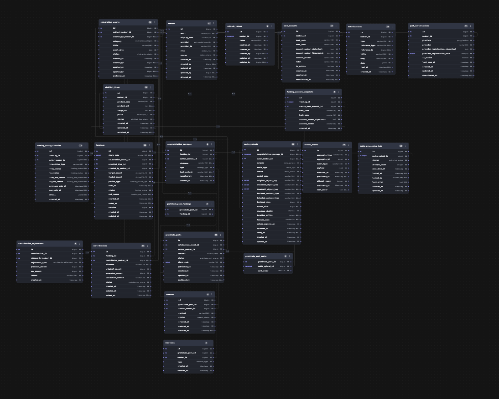
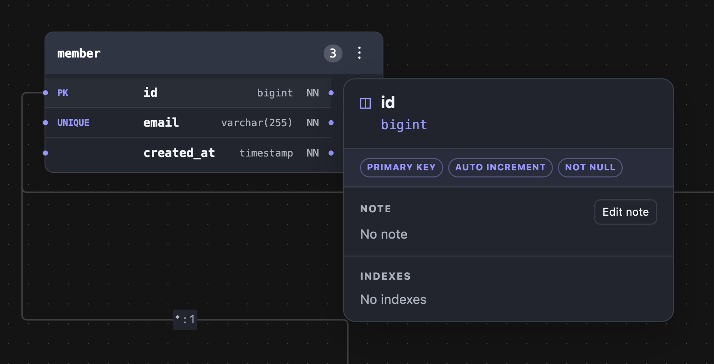
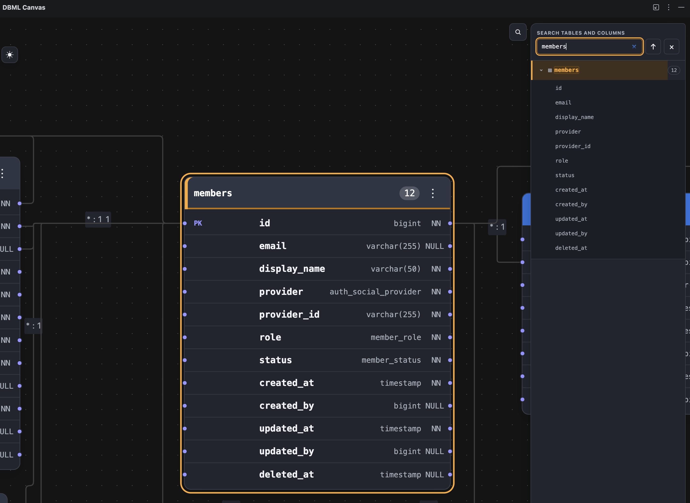

<div align="center">


# DBML Canvas

**A Git-native, AI-readable ERD workflow for DBML — in your browser, VS Code, and JetBrains IDEs.**

English | [한국어](README.ko.md)

[](https://marketplace.visualstudio.com/items?itemName=thinkgrowstudio.dbml-canvas-vscode)
[](https://marketplace.visualstudio.com/items?itemName=thinkgrowstudio.dbml-canvas-vscode)
[](https://plugins.jetbrains.com/plugin/33410-dbml-canvas)
[](https://plugins.jetbrains.com/plugin/33410-dbml-canvas)




</div>

---

## Table of Contents

- [Why DBML Canvas?](#why-dbml-canvas)
- [Features](#features)
- [Screenshots](#screenshots)
- [Installation](#installation)
- [Usage](#usage)
- [Development](#development)
- [Building the IDE Plugins](#building-the-ide-plugins)
- [Layout File Format](#layout-file-format)
- [Architecture](#architecture)
- [Tech Stack](#tech-stack)
- [Roadmap](#roadmap)
- [Contributing](#contributing)
- [License](#license)
- [Acknowledgements](#acknowledgements)

## Why DBML Canvas?

Most ERD tools keep the diagram in a proprietary, binary, or cloud-only format. That makes schemas hard to review in pull requests and impossible for coding agents to read.

DBML Canvas separates **what** the schema is from **how** it looks:

| File | Role |
| --- | --- |
| `schema.dbml` | The single source of truth for tables, columns, relations, enums, and notes |
| `schema.dbml.layout.json` | A tiny sidecar with only table positions, colors, and viewport |

Both files are plain text, diff cleanly in Git, and can be read and edited by humans and AI agents alike. The same renderer runs in a web sandbox, a VS Code webview, and a JetBrains JCEF tool window.

## Features

- **DBML → interactive ERD** — powered by `@dbml/core` (`dbmlv2` parser) and React Flow, with draggable tables, zoom, pan, and minimap.
- **Column-level relationships** — FK edges connect to exact column handles, with cardinality labels (`*:1`, `1:1`, …) and orthogonal routing that avoids overlapping tables.
- **Rich hover details** — table/column Notes, indexes, defaults, constraints (`PRIMARY KEY`, `AUTO INCREMENT`, `NOT NULL`, …), FK targets, and enum values with value notes.
- **Safe Note editing on the canvas** — edit table and column `Note` values directly; edits are validated by re-parsing DBML and applied as minimal text ranges through native IDE APIs, so **undo/redo works as usual**.
- **Table & column search** — a schema explorer to find and jump to any table or column.
- **Portable, Git-friendly layout** — positions and five theme-aware table colors are stored in a deterministic JSON sidecar, never in the DBML itself.
- **Live refresh** — the ERD updates when the DBML file changes, including edits made outside the IDE.
- **Light / dark theme** — follows the host IDE theme, with a manual toggle.
- **Built for large schemas** — FK routing is managed as a drag session so only affected edges update while dragging.
- **Source navigation** — jump from the canvas back to the DBML definition in the editor.

## Screenshots

<table>
  <tr>
    <td align="center" width="50%">
      <br />
      <sub><b>Column detail card</b> — constraints, Note editing, and indexes on hover</sub>
    </td>
    <td align="center" width="50%">
      <br />
      <sub><b>Schema search</b> — find tables and columns and focus them on the canvas</sub>
    </td>
  </tr>
  <tr>
    <td align="center" colspan="2">
      <br />
      <sub><b>Large schema overview</b> — dozens of tables with column-level FK routing</sub>
    </td>
  </tr>
</table>

## Installation

| Platform | Install |
| --- | --- |
| **VS Code** | [Visual Studio Marketplace](https://marketplace.visualstudio.com/items?itemName=thinkgrowstudio.dbml-canvas-vscode) — or search **"DBML Canvas"** in the Extensions view |
| **JetBrains IDEs** | [JetBrains Marketplace](https://plugins.jetbrains.com/plugin/33410-dbml-canvas) — **Settings → Plugins → Marketplace**, search **"DBML Canvas"** |

The JetBrains plugin supports IntelliJ IDEA, WebStorm, PyCharm, GoLand, DataGrip and other JetBrains IDEs **2025.3 or later**.

> **Performance tip (JetBrains):** for smoother diagram interactions you can optionally run JCEF in-process. Open **Help → Edit Custom VM Options**, add `-Dide.browser.jcef.out-of-process.enabled=false`, then fully restart the IDE.

## Usage

1. Open a `.dbml` file.
2. **VS Code:** click **DBML Canvas: Open Preview** in the editor toolbar (or run it from the Command Palette).
   **JetBrains:** open the **DBML Canvas** tool window.
3. Drag tables to arrange the diagram — the layout is saved automatically next to your schema:

```text
schema.dbml
schema.dbml.layout.json   ← positions, colors, viewport (generated)
```

Commit both files so your teammates (and AI agents) see the same diagram.

## Development

### Prerequisites

- Node.js **22** or later
- (IntelliJ plugin only) JDK **21**

### Run the browser sandbox

```bash
npm install
npm run dev
```

Open the URL printed by Vite. A ready-to-open example lives in [`examples/schema.dbml`](examples/schema.dbml).

### Build, type-check, and test

```bash
npm run build       # build all JS/TS packages and apps
npm run typecheck   # type-check the workspace
npm test            # run unit tests (core, renderer, apps, legal notices)
```

## Building the IDE Plugins

### VS Code

```bash
npm run build:vscode
```

Open `apps/vscode-extension` in VS Code and launch the Extension Development Host. Open a `.dbml` file and run:

```text
DBML Canvas: Open Preview
```

The extension writes the layout beside the DBML file:

```text
schema.dbml
schema.dbml.layout.json
```

To build a distributable `.vsix`:

```bash
cd apps/vscode-extension
npm run package
```

### JetBrains (IntelliJ Platform)

```bash
npm run build:webview          # build the shared host webview
cd apps/intellij-plugin
./gradlew runIde               # run a sandbox IDE with the plugin
./gradlew buildPlugin          # package an installable ZIP
```

The plugin targets IntelliJ Platform 2025.3 (`253`) or later. The Gradle build copies `apps/host-webview/dist` into plugin resources automatically, so rebuild the webview after frontend changes. Install the ZIP from `build/distributions/` via **Settings → Plugins → ⚙ → Install Plugin from Disk**.

## Layout File Format

```json
{
  "version": 1,
  "nodes": {
    "public.member": { "x": 80, "y": 120, "color": "blue" },
    "public.answer": { "x": 520, "y": 120 }
  },
  "viewport": { "x": 0, "y": 0, "zoom": 1 }
}
```

Table IDs are deterministic (`schema.table`); columns use `schema.table.column`. Notes always live in DBML and are never duplicated into the layout file.

## Architecture

```text
@dbml/core
    ↓  DbmlCoreSchemaParser (adapter)
ErdSchema  ← our stable internal model
    ↓  applyLayout
React renderer (React Flow)
    ↓  HostBridge messages
Web sandbox / VS Code webview / IntelliJ JCEF
```

```text
packages/
├── core/            # Pure TS: parser adapter, ErdSchema, layout merge, Note edits, host protocol
└── renderer/        # React + React Flow: tables, FK edges, details, search
apps/
├── web-sandbox/     # Browser playground with local layout persistence
├── host-webview/    # Generic IDE-hosted webview app
├── vscode-extension/# VS Code adapter (TypeScript)
└── intellij-plugin/ # JetBrains adapter (Kotlin, JCEF)
```

Key design decisions:

1. **DBML is the only schema-editing source of truth.** The canvas edits Notes only.
2. **The renderer never touches files** and doesn't know which host it runs in.
3. **Parser isolation** — the UI consumes a `SchemaParser` interface, so `@dbml/core` changes never leak into the renderer, and other parsers (Prisma, SQL DDL, JPA) can be added later.
4. **The layout format belongs to DBML Canvas**, not React Flow — only positions, viewport, and color tokens are persisted.

See [`docs/architecture.md`](docs/architecture.md) for details and [`VALIDATION.md`](VALIDATION.md) for completed checks.

## Tech Stack

| Area | Technologies |
| --- | --- |
| Core | TypeScript, `@dbml/core` |
| Rendering | React 19, React Flow (`@xyflow/react`), `react-flow-smart-edge` |
| Web | Vite |
| VS Code | VS Code Extension API, Webview |
| JetBrains | Kotlin, IntelliJ Platform, JCEF, Gradle |
| Tooling | npm workspaces, Node test runner |

## Roadmap

- [x] DBML parsing and interactive ERD rendering
- [x] Hover detail cards and enum values
- [x] Safe table/column Note editing with native undo/redo
- [x] Table and column search
- [x] Live refresh on external DBML changes
- [x] Drag performance optimization for large schemas
- [ ] Relationship line route editing
- [ ] Multiple named views
- [ ] Multi-file DBML projects
- [ ] Unified parser error model

## Contributing

Bug reports and feature ideas are welcome via [GitHub Issues](https://github.com/kchsoft/DBML-canvas/issues). Because DBML Canvas is distributed under a proprietary license (see below), please open an issue to discuss before submitting a pull request.

Commit messages follow [Conventional Commits](https://www.conventionalcommits.org/) (`feat:`, `fix:`, `perf:`, `docs:`, `chore:` …).

## License

Copyright © 2026 thinkgrowstudio. All rights reserved.

DBML Canvas is **proprietary software**. The source is publicly viewable, but no permission is granted to copy, modify, redistribute, or create derivative works except as allowed by the [End User License Agreement](EULA.md). See [`LICENSE`](LICENSE) for the full notice.

Third-party open-source components remain under their own licenses; see [`THIRD_PARTY_NOTICES.txt`](THIRD_PARTY_NOTICES.txt).

## Acknowledgements

- [DBML](https://dbml.dbdiagram.io/) and [`@dbml/core`](https://github.com/holistics/dbml) by Holistics — the language and parser this project builds on
- [React Flow](https://reactflow.dev/) by xyflow — the canvas engine
- [react-flow-smart-edge](https://github.com/tisoap/react-flow-smart-edge) — edge routing

> DBML Canvas is an independent project and is not affiliated with or endorsed by Holistics or dbdiagram.io.

---

<div align="center">

Questions? Contact <a href="mailto:studiothinkgrow@gmail.com">studiothinkgrow@gmail.com</a>

</div>
